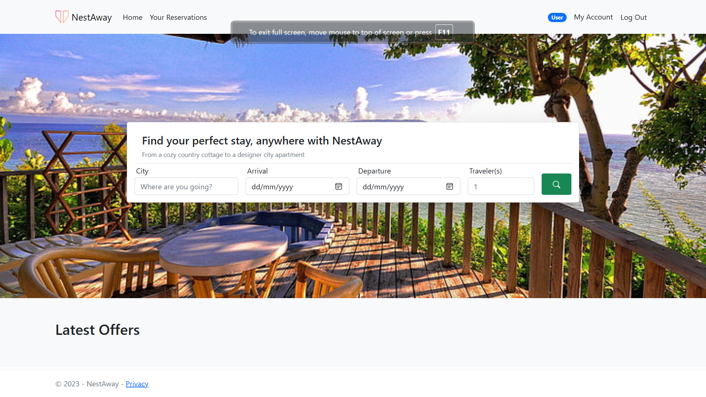

---

# NestAway

A marketplace platform built with ASP.NET Core 8 for booking homestays and experiences.

## Description

NestAway is an Airbnb clone developed as an academic project. The platform allows users to browse, book, and manage homestays and experiences.

## Features

- **User Authentication**: Secure login and registration.
- **Property Listings**: View detailed listings of available homestays.
- **Booking System**: Book homestays and experiences.
- **Admin Panel**: Manage listings, bookings, and user accounts.
- **Responsive Design**: Optimized for both desktop and mobile devices.

## Technologies Used

- **Backend**: ASP.NET Core 8
- **Frontend**: HTML, CSS, JavaScript
- **Database**: Microsoft SQL Server
- **Others**: Entity Framework Core, Bootstrap

## Installation

1. **Clone the repository:**
   ```sh
   git clone https://github.com/saugataroyarghya/NestAway.git
   ```
2. **Navigate to the project directory:**
   ```sh
   cd NestAway
   ```
3. **Setup the database:**
   - Update the connection string in `appsettings.json`.
   - Run the database migrations:
     ```sh
     dotnet ef database update
     ```
4. **Run the application:**
   ```sh
   dotnet run
   ```

## Usage

- Register or log in to your account.
- Browse available homestays and experiences.
- Book your desired stay or experience.
- Manage your bookings from your profile.

## Pics
- **Home Page**:  
  

## License

This project is licensed under the GNU General Public License v3.0. See the [LICENSE](LICENSE) file for details.
